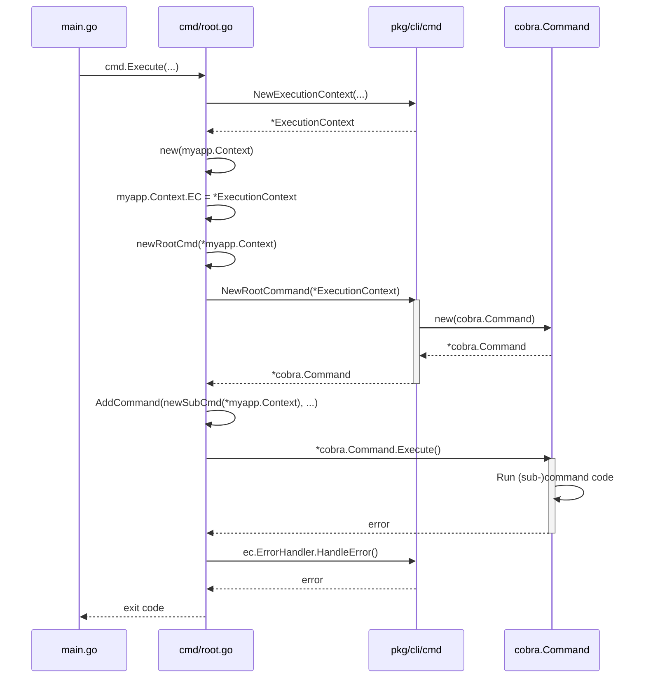

# CLI packages Tutorial

## Table of Contents

- [Introduction](#introduction)
- [Getting Started](#getting-started)
- [Core Concepts](#core-concepts)
  - [The Execution Context](#the-execution-context)
  - [Persistent/Global Flags](#persistentglobal-flags)
  - [Logging](#logging)
  - [Error Handling](#error-handling)
  - [Commands and Sub-Commands](#commands-and-sub-commands)
  - [UI Elements](#ui-elements)
- [Building a Simple Project](#building-a-simple-project)

## Introduction

The `cli` packages help you build Command Line Interfaces (CLIs) that conform
to [Scroll 11](https://scr.k8s.netic.dk/0011/).

The packages are:

- [`cmd`](cmd/) — provides helpers for building the root command and
  sub-commands. It sets sensible defaults, global flags, configuration
  files, etc. It also adds an interface to sub-commands that makes
  completing, validating and running commands more predictable, and
  it provides a way to handle errors in a consistent way.
- [`ui`](ui/) — provides UI elements such as tables, spinners, select
  boxes, prompts, etc.

This tutorial covers basic usage and the core concepts of these packages.

### Target Audience

The target audience for this tutorial is someone proficient with go but not
necessarily an expert. You should expect to read up on how
[spf13/cobra](https://github.com/spf13/cobra) works.

### Prerequisites

- go 1.22+

## Getting Started

Let's create a hello world CLI that prints a greeting when we run it.

You can look at the code in the [examples/helloworld](examples/helloworld/)
directory.

First, initialize the project:

```bash
mkdir helloworld
cd helloworld
go mod init helloworld
```

Download the go-common module:

```bash
go get -u github.com/neticdk/go-common
```

Create the `internal/helloworld` directory which will hold the application
context and basic information about the CLI:

```bash
mkdir -p internal/helloworld
```

Create `internal/helloworld/context.go`:

```go
package helloworld

import "github.com/neticdk/go-common/pkg/cli/cmd"

type Context struct {
    EC *cmd.ExecutionContext
}

func NewContext() *Context {
    return &Context{}
}
```

Here we set up the Application Context. Think of it as the container for
application information and dependencies. It will vary from project to project.

For now it just holds a pointer to the
[`ExecutionContext`](#the-execution-context) which you will learn more about later.

Create the `cmd` directory which will hold the code for the CLI commands:

```bash
mkdir cmd
```

Note, as this is a project with a single executable, we will put command code in
`cmd/` and keep a minimal `main.go` in the root project directory. For more
advanced tools that have multiple executables, you should create a directory for
each executable named `cmd/<executable-name>/` with its own `main.go` file. This
is an advanced topic and is not covered here.

Next, create `cmd/root.go`:

```go
package cmd

import (
    "os"

    "helloworld/internal/helloworld"

    "github.com/neticdk/go-common/pkg/cli/cmd"
    "github.com/spf13/cobra"
)

const (
    AppName   = "helloworld"
    ShortDesc = "A greeting app"
    LongDesc  = `This application greets the user with a friendly messages`
)

// newRootCmd creates the root command
func newRootCmd(ac *helloworld.Context) *cobra.Command {
    c := cmd.NewRootCommand(ac.EC).
        Build()

    c.AddCommand(
        newHelloCmd(ac),
    )

    return c
}

// Execute runs the root command and returns the exit code
func Execute(version string) int {
    ec := cmd.NewExecutionContext(
        AppName,
        ShortDesc,
        version,
        os.Stdin,
        os.Stdout,
        os.Stderr)
    ac := helloworld.NewContext()
    ac.EC = ec
    ec.LongDescription = LongDesc
    rootCmd := newRootCmd(ac)
    err := rootCmd.Execute()
    _ = ec.Spinner.Stop()
    if err != nil {
        ec.ErrorHandler.HandleError(err)
        return 1
    }
    return 0
}
```

This is the main entry point for handling CLI commands. The `Execute()`
function sets up the `ExecutionContext` and Application Context, runs the root
command (`newRootCmd().Execute()`) and handles errors.

Notice the constants `AppName`, `ShortDesc` and `LongDesc`. These are used
to identify and document your CLI, i.e when using `--help` or the `help`
command.

The `newRootCmd()` function adds a sub-command, `newHelloCmd()`, but we
haven't set that up yet, so let's do that now.

Create `cmd/hello.go`:

```go
package cmd

import (
    "context"

    "helloworld/internal/helloworld"

    "github.com/neticdk/go-common/pkg/cli/cmd"
    "github.com/neticdk/go-common/pkg/cli/ui"
    "github.com/spf13/cobra"
)

func newHelloCmd(ac *helloworld.Context) *cobra.Command {
    o := &helloOptions{}
    c := cmd.NewSubCommand("hello", o, ac).
        WithShortDesc("Say hello!").
        Build()

    return c
}

type helloOptions struct {
    who string
}

func (o *helloOptions) Complete(_ context.Context, ac *helloworld.Context) error {
    if len(ac.EC.CommandArgs) > 0 {
        o.who = ac.EC.CommandArgs[0]
    } else {
        o.who = "World"
    }
    return nil
}

func (o *helloOptions) Validate(_ context.Context, _ *helloworld.Context) error { return nil }

func (o *helloOptions) Run(_ context.Context, ac *helloworld.Context) error {
    ui.Info.Printf("Hello, %s!\n", o.who)
    return nil
}
```

What you created here is a sub-command named `hello`. It has a short
description, "Say hello!" and a struct `helloOptions` to hold information such
as flag values or in this case who to say hello to.

You may notice the Application Context (`ac`) being passed to
The following mechanism enables automatic command execution and will be explained in detail in the Commands section
sure that `Complete()`, `Validate()` and `Run()` are executed when the
sub-command runs.

The `Complete()` command checks if there is an additional argument given to the
sub-command and uses that argument as the value for who to greet. It defaults to
"World" if none is given.

The `Run()` command executes the command and in this case prints out the
message.

Now all you need to do it make sure you CLI runs.

Create `main.go` which will run `cmd.Execute()`:

```go
package main

import (
    "os"

    "helloworld/cmd"
)

var version = "HEAD"

func main() {
    os.Exit(cmd.Execute(version))
}
```

This runs the `Execute` function and exits with the status code returned.

We use the `version` variable to set the version of the CLI when building it.
The `go build` flag `-ldflags` can override variable values at build time and we
use that to set the version to the current git tag. Example:

```bash
VERSION=$(git describe --tags --always --match=v* 2>/dev/null || echo v0 | sed -e s/^v//)
go build -o bin/ -ldflags '-s -w -X main.version=${VERSION}'
```

Install dependencies:

```bash
go mod tidy
```

The directory structure should look like this:

```console
.
├── cmd
│   ├── hello.go
│   └── root.go
├── internal
│   └── helloworld
│       └── context.go
├── go.mod
├── go.sum
└── main.go
```

Now run the CLI:

```bash
go run .
```

That prints out:

```console
This application greets the user with a friendly messages

## Usage

helloworld [command] [flags]
helloworld [command]

Basic Commands:

Other Commands:
completion  Generate the autocompletion script for the specified shell
help        Help about any command

## Additional Commands

  hello       Say hello!

## Flags

  -d, --debug               Debug mode
      --log-format string   Log format (plain|json) (default "plain")
      --log-level string    Log level (debug|info|warn|error) (default "info")
  -o, --output string       Output format (default "plain")
      --no-color            Do not print color
  -h, --help                help for helloworld
  -v, --version             version for helloworld

Use "helloworld [command] --help" for more information about a command.
```

That doesn't say hello anything. That's because you didn't specify the `hello`
command yet. Let's add that:

```bash
go run . hello
```

Your application should greet you with a friendly 'Hello, World!' message:

```console
 INFO  Hello, World!
```

Running it with an argument:

```bash
go run . hello John
```

… prints a greeting to John:

```console
 INFO  Hello, John!
```

And that concludes the getting started guide. Next up is core concepts.

## Core Concepts

### Execution Overview



This is how the CLI executes. It is explained in details below.

### The Execution Context

The `ExecutionContext` is a struct containing information relevant to the
execution of the CLI but not necessarily coupled to the application directly.

Some of the important things it contains:

- information about the CLI such as the name and description
- a `Logger`
- an `ErrorHandler`
- the `OutputFormat`
- cobra related attributes such as `Command`, `CommandArgs`
- persistent/global flags (`PFlags`) configuration

You instantiate it using:

```go
import "github.com/neticdk/go-common/pkg/cli/cmd"

ec := cmd.NewExecutionContext(
    "app name",
    "app description",
    "app version",
    os.Stdin,
    os.Stdout,
    os.Stderr)
```

The application name and description are used in the usage/help message for the
root command. The three I/O arguments are used to determine where to read input
and write output and errors. They can be set to `nil` in which case OS defaults
are used.

#### Using the `ExecutionContext`

The `ExecutionContext` can be used by itself but works better when embedded in
other context structs such an application context:

```go
package myapp

type Context struct {
    EC *cmd.ExecutionContext

    // Example
    DB db.DB
}

ac := &Context{
    EC: cmd.NewExecutionContext(...)
}
```

That way you will always have things like the `Logger`, `ErrorHandler`
and I/O pipes available.

Create it and pass it to `newRootCmd` from `Execute()` in `cmd/root.go`:

```go
func Execute(version string) {
// ..
ec := cmd.NewExecutionContext(...)
ac := &myapp.Context{EC: ec}
rootCmd := newRootCmd(ac)
```

Then pass it from `newRootCmd` via `myapp.Context` to the functions used to
create commands:

```go
func newRootCmd(ac *myapp.Context) {
    c := cmd.NewRootCommand(ac.EC)
    // ...
    c.AddCommand(
        NewSubCmd(ac),
    )
}

// or for sub-commands

func newSubCmd(ac *myapp.Context) {
    o := &options{}
    c := cmd.NewSubCommand("name", o, ac)
    // ...
}
```

The [Commands and Sub-Commands](#commands-and-sub-commands) section explains
the `NewRootCommand` and `NewSubCommand` functions in detail. For now it's fine
to know that they create the respective `cobra.Command` and make the `Context`
available later on.

In the root command the `ExecutionContext` is available for all fields of the
`*cobra.Command` passed to or returned from `NewRootCommand`:

```go
func newRootCmd(ac *myapp.Context) {
    c := cmd.NewRootCommand(ac.EC).
        WithInitFunc(func(_ *cobra.Command, _ []string) error {
            ac.SetupDefaultGithubClient()
            ac.SetupDefaultGitRepository()
            return nil
        }).
        Build()
    c.PreRun = func(_ *cobra.Command, args []string) {
        ac.EC.Logger.Info("some message")
    }
    // ...
}
```

Here the `WithInitFunc` uses functions on the `Context` to do some
initialization. `WithInitFunc` is a way to add code to the `PersistentPreRunE`
function on the `cobra.Command` struct. It can be used like here to setup
defaults or dependencies on the `Concext`.

For sub-commands, the `NewSubCommand` passes down the context to the
`Complete`, `Validate` and `Run` functions:

```go
func InitComponentCmd(ac *myapp.Context) *cobra.Command {
    o := &options{}
    c := cmd.NewSubCommand("command", o, ac).
        Build()
    // ...
}

// passing ac to NewSubCommand automatically makes it available as the second
// argument to Complete, Validate and Run

func (o *options) Complete(ctx context.Context, ac *myapp.Context) error {
    // Here we are using the ExecutionContext Logger
    ac.EC.Logger.Info("some info")
    return nil
}

func (o *options) Validate(ctx context.Context, ac *myapp.Context) error {
    return nil
}

func (o *options) Run(ctx context.Context, ac *myapp.Context) error {
    // Here we are using a GithubClient injected through the Context
    err := ac.GithubClient.GetRepository(...)
    // And here we again use ExecutionContext for accessing the error handler
    if err != nil {
        return ac.EC.ErrorHandler.NewGeneralError(
            "Some error",
            "Some message",
            err,
            0)
    }
}
```

Note that the third argument passed to `NewSubCommand` is generic, so anything
you pass there will end up becoming the second argument to the three functions.
In most cases this will be the Application Context. More on that later.

### Persistent/Global Flags

The `cmd` package comes with default persistent flags, some of which are
permanent/mandatory and some of which can be toggled. Persistent flags are
always present for all commands.

To enable setting a flag (not enabling the flag itself), set `<FLAG>Enabled`
to `true`:

```go
ec := cmd.NewExecutionContext(...)
ec.PFlags.DryRunEnabled = true
```

This makes it possible to use the `--dry-run` flag.

See [`cmd/flags.go`](cmd/flags.go) for more information about available flags.

Flags that can't be disabled:

- `--log-format`
- `--log-level`
- `--output`, `-o`
- `--no-color`
- `--debug`, `-d`

#### Setting the output format

The output format is a way to instruct the application about the format the user
wants output in. Typically this would be plain text for humans and something
like JSON for machines. This can be set the `--output` or `-o` flag.

`ExecutionContext.OutputFormat` stores the output format as a string:

- `cmd.OutputFormatPlain` - `plain`
- `cmd.OutputFormatJSON` - `json`
- `cmd.OutputFormatYAML` - `yaml`
- `cmd.OutputFormatMarkdown` - `markdown`
- `cmd.OutputFormatTable` - `table`

#### Enabling flags

The best place to set global flags is in the `Execute()` command in
`cmd/root.go`:

```go
// Execute runs the root command and returns the exit code
func Execute(version string) int {
    ec := cmd.NewExecutionContext(
        AppName,
        ShortDesc,
        version,
        os.Stdin,
        os.Stdout,
        os.Stderr)
    ac := myapp.NewContext()
    ec.PFlags.ForceEnabled = true
    ec.PFlags.JSONEnabled = true
    ac.EC = ec
    ec.LongDescription = LongDesc
    rootCmd := newRootCmd(ac)
    err := rootCmd.Execute()
    _ = ec.Spinner.Stop()
    if err != nil {
        ec.ErrorHandler.HandleError(err)
        return 1
    }
    return 0
}
```

### Logging

The package uses `log/slog` for logging and places the logger on
`ExecutionContext.Logger`.

#### Default ErrorHandler

The default handler uses the `pterm` package which adds a bit of color to the
log messages. The default format depends on whether there is a TTY attached. If
there is then the format is `plain` text, unless `--log-format` is used.
Otherwise it uses `json`.

The default log level is INFO. To change this, use the `--log-level` flag.

#### Using your own handler

You can change the handler after initialing the context:

```go
import "github.com/charmbracelet/log"

ec := cmd.NewExecutionContext(...)

handler := log.New(os.Stderr)
ec.Logger = slow.New(handler)

```

#### Using the logger

Just use `ec.Logger.Info()` (or `ac.EC.Logger.Info()`) etc. like you would use `slog`.

It is recommended to create sub-loggers for each sub-command using:

```go
func (o *options) Run(ctx context.Context, ac *myapp.Context) error {
    logger := ac.EC.Logger.WithGroup("Driver")  // or some other meaningful name
    logger.Info("some info")
    // ...
}
```

### Error Handling

The `ExecutionContext` comes with a default error handler
(`errors.DefaultErrorHandler`) that implements this interface:

```go
// ErrorHandler is an interface for handling errors.
type ErrorHandler interface {
    // HandleError handles the given error.
    HandleError(err error)
    // NewGeneralError creates a new GeneralError with the specified message, help message, error, and code.
    NewGeneralError(message, helpMsg string, err error, code int) *GeneralError
    // SetWrap sets whether to wrap the error message and help message.
    SetWrap(wrap bool)
    // SetWrapWidth sets the width to wrap the error message and help message.
    SetWrapWidth(width int)
}
```

The `Execute()` function in `cmd/root.go` handles errors that bubble up from your application:

```go
func Execute(...) int {
    // ...
    err := rootCmd.Execute()
    _ = ec.Spinner.Stop()
    if err != nil {
        ec.ErrorHandler.HandleError(err)
        return 1
    }
    return 0
}
```

The `DefaultErrorHandler` handles two types of errors:

- `ErrorWithHelp` is used for printing user friendly errors with context
- The built in `error` handling all other errors

`ErrorWithHelp` is an interface:

```go
type ErrorWithHelp interface {
    error
    Help() string
    Unwrap() error // Optional: for wrapped errors
    Code() int     // Optional: for error codes
}
```

Using a type that implements this interface  as an `error` will make sure
it is printed out in a nice format for the user.

There are two error types included that implements this interface:

- `GeneralError` - which can handle most cases
- `InvalidArgumentError` - specifically made for parsing arguments and flags

Use `GeneralError` like this:

```go
import "github.com/neticdk/go-common/pkg/cli/cmd"

const ErrorCodeParsingError = 42

func myFunc() error {
    // ...
    return &cmd.GeneralError{
        Message: "Could not parse config.json",
        HelpMsg: "This happens when the file format is invalid. See details for more.",
        Err:     err,
        CodeVal: ErrorCodeParsingError,
    }
}
```

There is also a short hand helper for `GeneralError`:

```go
return ac.EC.ErrorHandler.NewGeneralError(
    "Could not parse config.json",
    "This happens...",
    err,
    0)
```

You can also use the `NewGeneralError` function to create a new `GeneralError`.
The helper function allows you to set formatted message and help message.

```go
return cmd.NewGeneralError(err).
        WithMessage("Could not parse %s", filename).
        WithHelp("This happens...").
        WithCode(0).
        Build()
```

Using error codes is optional.

Use `InvalidArgumentError` like this:

```go
import "github.com/neticdk/go-common/pkg/cli/cmd"

func (o *options) Validate(ctx context.Context, ac *myapp.Context) {
    return &cmd.InvalidArgumentError{
        Flag:    "name",
        Val:     o.Name,
        Context: "It must be an ASCII string of minimum 3 characters length.",
    }
    // ...
}
```

### Commands and Sub-Commands

The two helpers `cmd.NewRootCommand` and `cmd.NewSubCommand` are used to create
root commands and sub-commands respectively.

They implement the builder pattern (chaining functions that modifies the return
value) and both return a `*cobra.Command`. This means that everything you can do
with `cobra.Command`, you can do with these helpers. They are just meant to
set reasonable defaults and enable some features that you almost always want.

`NewRootCommand(ec *ExecutionContext).Build()` creates a root command with:

- Usage, descriptions, versions, etc. set
- Default global flags added
- Logging enabled
- Configuration through configuration files, environment variables, and
  flags enabled (via `viper`)
- Colors added to `help` commands
- Two command groups added (`cmd.GroupBase`, and `cmd.GroupOther`)
- A hidden `gendocs` command for generating documentation

`NewSubCommand[T any](name string, runner SubCommandRunner[T], runnerArg
T)).Build()` works a little different. It takes the name of the command,
a runner interface and an argument passed to the runner interface functions.
Let's break the last two down because they are important to understand.

The runner interface looks like this:

```go
// SubCommandRunner is an interface for a subcommand runner
type SubCommandRunner[T any] interface {
    // Complete performs any setup or completion of arguments
    Complete(ctx context.Context, arg T) error

    // Validate checks if the arguments are valid
    // Returns error if validation fails
    Validate(ctx context.Context, arg T) error

    // Run executes the command with the given arguments
    // Returns error if execution fails
    Run(ctx context.Context, arg T) error
}
```

This means that the type must implement these three functions.

In short, to implement the `SubCommandRunner` interface the following must be in
place:

- All three functions must be implemented on the struct passed as the
  second argument to `NewSubCommand`.
- The type of the second argument to each of the three functions must be the
  same as the type of the third argument passed to `NewSubCommand`.

The smallest possible implementation looks like this:

```go
type runner[T any] struct{}

func (o *runner[T]) Complete(ctx context.Context, runnerArg T) error { return nil }
func (o *runner[T]) Validate(ctx context.Context, runnerArg T) error { return nil }
func (o *runner[T]) Run(ctx context.Context, runnerArg T) error      { return nil }
```

In fact the `cmd` package already includes a `NoopRunner` type that looks
exactly like this (it comes in handy when you are creating sub-commands that
does nothing but serve other sub-commands).

It works together with `runnerArg` in `NewSubCommand`. `runnerArg` can by any
type and it is available as the same type in the three functions. It ensures
that we can pass down Application Context or anything else to be used later on
in the application.

The pattern with the three functions is called the complete-validate-run pattern
and is used by the kubernetes project amongst others. It adds predictability
because you are using the exact same pattern for all sub-commands. Behind the
scenes it overrides the `RunE` field of `*cobra.Command` with a function
that looks like this:

```go
return func(cmd *cobra.Command, args []string) error {
    ctx := cmd.Context()
    if err := runner.Complete(ctx, runnerArg); err != nil {
        return err
    }
    if err := runner.Validate(ctx, runnerArg); err != nil {
        return err
    }
    return runner.Run(ctx, runnerArg)
}
```

It comes at the cost of losing some flexibility. If you need that flexibility,
you can always set `RunE` on `cobra.Cobra` to do your own thing.

When the sub-command runs, it runs these three functions in order:

`Complete` completes any settings/configuration/flags/etc. before validation.
It return an error.

Given this struct:

```go
type options struct {
    name string
    age  int
    car  string
    dest string
}
```

The `Complete` function could do something like this:

```go
func (o *options) Complete(_ context.Context, ac *myapp.Context) error {
    if o.age > 50 {
        ac.EC.Logger.Warn("Elderly chap found")
        o.car == "Mercedes E350"
    }
    return nil
}
```

`Validate` validates flags, arguments and other settings/requirements. It
returns an error.

```go
func (o *options) Validate(_ context.Context, ac *myapp.Context) error {
    if o.age < 18 {
        return ac.EC.ErrorHandler.NewGeneralError(
            "Child detected",
            "The person under under 18 years old and cannot drive a car."
            err,
            0)
    }
}
```

Finally, the `Run` function runs the command. It also returns error:

```go
func (o *options) Run(ctx context.Context, ac *myapp.Context) error {
    return car.Drive(ctx, o.name, o.car, o.dest)
}
```

It is from the `Run` command that you usually hand over control of your
application to other parts of your code.

Did you notice that `ac *myapp.Context` in the function signatures? That is
the third argument passed to `NewSubCommand`. This makes that argument
available to the rest of the application.

#### Flags

At this point you might be wondering how the options are populated from command
line flags in the first place?

This is where binding comes in:

```go
func newDriveCmd(ac *myapp.Context) *cobra.Command {
    o := &driveOptions{}
    c := cmd.NewSubCommand("drive", o, ac).
        WithShortDesc("Drive a car").
        WithLongDesc(driveCmdLongDescription()).
        WithExample(driveCmdExample()).
        WithGroupID(groupComponent).
        Build()

    return c
}
```

Flags are bound in to the options struct using the `SetupFlags` method.

You will have to create it yourself.

Let's see an example of how to do that:

```go
import "github.com/spf13/pflag"

func (o *driveOptions) SetupFlags(_ context.Context, ac *helloworld.Context) error {
    cmd := ac.EC.Command
    flags := cmd.Flags()

    flags.StringVar(&o.name, "name", "", "Driver name")
    flags.IntVar(&o.age, "age", 0, "Driver age")

    flags.SortFlags = false

    if err := cmd.MarkFlagRequired("name"); err != nil {
        return err
    }
    if err := cmd.MarkFlagRequired("age"); err != nil {
        return err
    }


    return nil
}
```

This binds the struct fields `o.name` and `o.age` to the values passed to
`--name` and `--age` respectively.

Now you may also have noticed that the example above used some builder
functions. They are essentially wrappers to set fields on the `cobra.Command`
struct. You may use them or just set the field values yourself after creating
the sub-command.

#### Accessing the cobra command

Sometimes you need access to the current `cobra.Command`. Use
`ExecutionContext.Command` to do that.

#### Accessing the command arguments

Checking the command arguments can also come in handy. The `args` can be
accessed through `ExecutionContext.CommandArgs`.

#### Documentation

It's pretty important to provide good documentation of your CLI and the
commands. A `cobra.Command` has a few fields to help with that, namely:

- `Use` which sets the short usage of the command
- `Short` which sets the short description of the command
- `Long` which sets the long description of the command
- `GroupID` which groups together commands
- `Example` which provides example usage for the command

`Use` is set automatically by `NewSubCommand`.

`Short` is set with `WithShortDesc()`.

`Long` is set with `WithLongDesc()`.

`GroupID` defaults to `cmd.GroupBase`. You can create your own groups by
defining them on the parent with `AddGroup`:

```go
const driveGroup = "group-drive"

c.AddGroup(
    &cobra.Group{
        ID:    groupDrive,
        Title: "Component Commands:",
    },
)
```

Then, reference the group in your sub-command:

```go
c := NewSubCommand(...).WithGroupID(driveGroup)
```

`Example` is pretty important, especially if the command is not straight forward
to use or if there are many flag combinations. You can set it with
`WithExample()` and it's recommended to create a separate function that returns
example usage:

```go
func newDriveCmd(...) {
    c := NewSubCommand("drive", ...).WithEaxmple(driveCmdExample())
    // ...
}

func driveCmdExample() string {
    b := strings.Builder{}

    b.WriteString("# Let john drive\n")
    b.WriteString("car drive --name john --age 62\n")

    return b.String()
}
```

### Use Cases

When creating your application you want to separate all of the command line
logic (flags parsing and validation, dependency injection, etc.) from the actual
business logic. In the Getting Started example above we cheated and just printed
out "Hello" in the `Run` function directly:

```go
func (o *helloOptions) Run(_ context.Context, ac *helloworld.Context) error {
    ui.Info.Printf("Hello, %s!\n", o.who)
    return nil
}
```

In real life applications things are rarely so simple. So, we encourage the use
of 'Use cases', a term taken from Clean Architecture.

From the Clean Architecture book:

> These use cases orchestrate the flow of data to and from the entities, and
> direct those entities to use their Critical Business Rules to achieve the
> goals of the use case.

In our case we don't follow Clean 100%, so we can take some liberties and
paraphrase this to something more broadly like:

> Use Cases encapsulate application-specific business rules

This means there are very loose constraints. Think of it as separation of
concerns or grouping logic into autonomous units. Often they will be named after
a thing within a business domain on which one can perform actions.

To implement this, keep your use cases in separate directories under
`internal/usecases`.

An example. Even though `car` is a very broad use case let's use it anyway.

The file `internal/usecases/car/drive.go` could contain something like:

```go
package car

import (
    "context"
    "log/slog"
)

func Drive(ctx context.Context, ac *myapp.Context, name, carName, dst string) error {
    ac.EC.Logger.InfoContext(ctx, "Driving my car!",
        slog.String("name", name),
        slog.String("car", carName),
        slog.String("destination", dst))
    car := ac.CarService.Get(ctx, carName)
    driver := ac.UserService.Get(ctx, name)
    destination := ac.LocationService.Get(ctx, dst)
    return ac.CarService.Drive(ctx, driver, car, dest)
}
```

An in our sub-command:

```go
func (o *options) Run(ctx context.Context, ac *myapp.Context) error {
    return car.Drive(ctx, ac, o.name, o.car, o.dest)
}
```

This makes it easier to separate concerns.

#### When to Create Use Cases

As mentioned, we encourage the use of use cases. But there is no need to
needlessly complicate things. If you are just doing something that borders what
may be called business logic or something small (think a few lines of code) it
is OK to keep the code in `Run`. But keep in mind that code in `cmd/` is *meant*
to handle command line logic, not business logic. So in the long run and for
maintainability it might be smart to create use cases even though they don't do
much.

### UI Elements

The `ui` package provides several components for building interactive command-line interfaces:

#### Tables

Use `ui.NewTable()` to create formatted tables:

```go
table := ui.NewTable(ac.EC.Stdout, []string{"Name", "Age", "City"})
err := table.WithData([][]string{
    {"John", "30", "New York"},
    {"Jane", "25", "Los Angeles"},
}).Render()
```

#### Selection Menus

`ui.Select()` creates interactive selection menus:

```go
options := []string{"Option 1", "Option 2", "Option 3"}
selected, err := ui.Select("Choose an option:", options)
```

#### Progress Indicators

`ui.Spin()` shows a spinner during long operations:

```go
ui.Spin(ac.EC.Spinner, "Processing...", func(s ui.Spinner) {
    // Long running operation
})
```

#### User Input

For user interaction:

- `ui.Confirm()` - Yes/No confirmations
- `ui.Prompt()` - Text input with optional validation

#### Status Output

Status prefix writers for consistent output formatting:

- `ui.Info` - Information messages
- `ui.Success` - Success messages
- `ui.Warning` - Warning messages
- `ui.Error` - Error messages

Example:

```go
ui.Success.Printf("Operation completed: %s\n", result)
```

Look at the [package](ui/) to see what is available.

See [examples/ui](examples/ui/) for example usage.

## Building a Simple Project

Check out [examples/pokemon](examples/pokemon/) for a more elaborate example
that showcases:

- dependency injection using the application context
- use cases
- some UI functionality
- and more!
